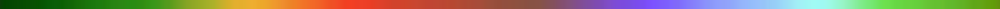

# Mandelbrot Set Visualization

This repository contains a Mandelbrot set visualization program implemented in C++ using [Simple and Fast Multimedia Library (SFML)](https://github.com/SFML/SFML) for graphics rendering. Additionally, the visualization benefits from GLSL fragment shaders for efficient computation of the Mandelbrot set.

## Features

- Real-time rendering of the Mandelbrot set with smooth zoom and pan functionalities.
- Utilizes GLSL fragment shaders for accelerated computation.
- Interactive user interface for navigation and exploration.
- Customizable parameters for the Mandelbrot set rendering.

## Usage

- Use arrow keys to pan the view.
- Scroll up/down to zoom in/out (or use `+/-` keys).
- Adjust parameters for different visualizations.
- Increase/decrease the number of iterations with `Right/Left Alt` key.
- To move around the screen more slowly, hold down `Shift`

## Customization

Load different gradient from `assets/gradients` folder (or add your custom gradient - image with ratio 1024x10).
- Rainbow:
  
- Pastel:
  
- Green-Red-Blue:
  
- Blue to yellow:
  
- Aquarelle:
  

Also you can customize some parameters:
- `iterations`: Maximum iterations for Mandelbrot set computation.
- `zoomFactor`: Zoom sensitivity.
- `velocity`: The velocity at which you move around the screen

## Examples

## License

This Mandelbrot set visualization program is open-source and available under the [MIT License](LICENSE). Feel free to use, modify, and distribute it.

## Acknowledgments

Special thanks to the SFML and GLSL communities for providing excellent tools and resources for graphics programming.

Happy fractal exploring! 🌀
